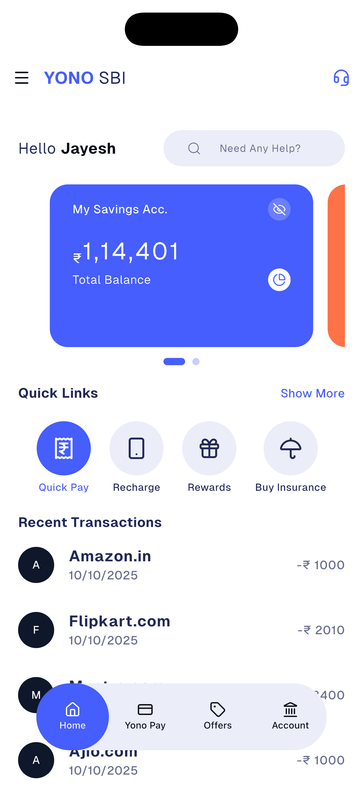
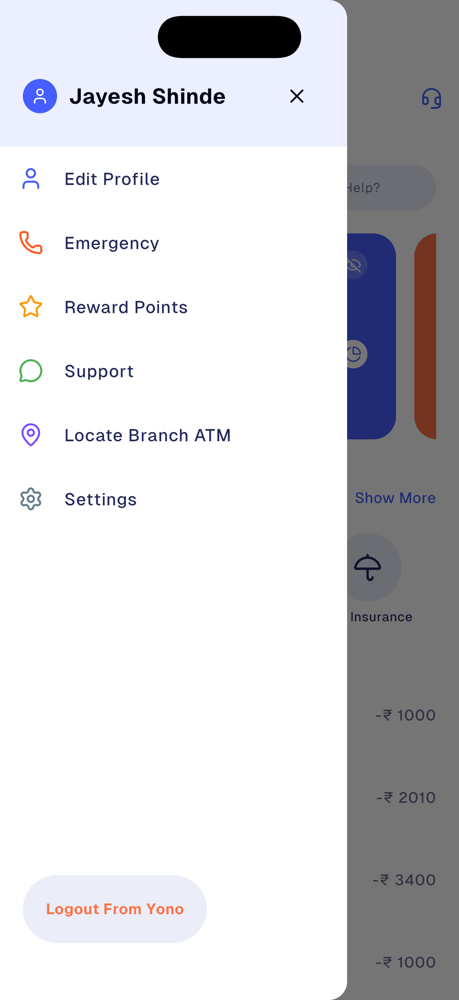

# SBI UNO UI Redesign in Flutter

A modern Flutter UI application for banking services, designed with a clean and intuitive user interface.

## About

SBI Uno is a Flutter-based mobile banking application UI that provides users with an elegant and user-friendly interface for managing their banking needs. The app features a modern design with smooth animations and a comprehensive set of banking features.

## Features

- **Account Overview**: View multiple account balances with swipeable cards
- **Quick Links**: Easy access to frequently used services
  - Quick Pay
  - Recharge
  - Rewards
  - Buy Insurance
- **Recent Transactions**: View your transaction history at a glance
- **Custom Navigation**: Bottom navigation bar with smooth transitions
- **Drawer Menu**: Side drawer for additional navigation options
- **Modern UI**: Built with shadcn_ui components for a polished look

## Screenshots






## Tech Stack

- **Framework**: Flutter
- **UI Components**: shadcn_ui
- **Icons**: Lucide Icons Flutter
- **Navigation**: Custom bottom navigation bar
- **State Management**: Flutter StatefulWidget

## Dependencies

- `shadcn_ui: ^0.39.3` - Modern UI component library
- `lucide_icons_flutter: ^3.1.6` - Beautiful icon set
- `flutter_native_splash: ^2.4.7` - Native splash screen
- `flutter_floating_bottom_bar: ^1.3.0` - Floating bottom navigation

## Getting Started

### Prerequisites

- Flutter SDK (3.8.0 or higher)
- Dart SDK
- Android Studio / Xcode (for mobile development)
- VS Code or Android Studio (recommended IDE)

### Installation

1. Clone the repository:

```bash
git clone <repository-url>
cd sbi_uno
```

2. Install dependencies:

```bash
flutter pub get
```

3. Run the app:

```bash
flutter run
```

## Project Structure

```
lib/
├── app/
│   └── features/
│       └── home/
│           └── home_screen.dart
├── consts/
│   └── colors.dart
├── widgets/
│   ├── appbar/
│   ├── bottom_nav/
│   ├── cards/
│   ├── drawer/
│   ├── heading/
│   ├── quick_links/
│   └── trasaction_tile/
└── main.dart
```

## UI Components

- **BalanceCard**: Displays account balance with customizable colors
- **QuickLinks**: Icon-based quick access buttons
- **CustomAppbar**: Custom app bar with drawer integration
- **TransactionTile**: Transaction list item component

## Notes

This is a UI-only project focused on design and user experience. Backend integration and API calls are not included in this version.

## Resources

- [Flutter Documentation](https://docs.flutter.dev/)
- [shadcn_ui Documentation](https://pub.dev/packages/shadcn_ui)
- [Lucide Icons](https://lucide.dev/)

## License

This project is for educational and demonstration purposes.
